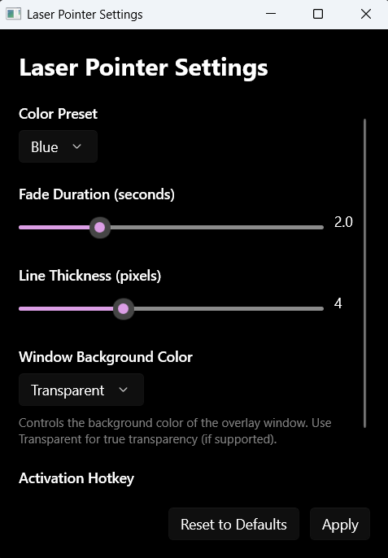

# Laser Pointer for Windows

A system-wide laser pointer overlay application for Windows that allows you to draw temporary lines on any screen, similar to Microsoft Whiteboard's laser pointer feature. Draw lines that automatically fade away, perfect for presentations, teaching, or highlighting content.

## Features

- **System-wide overlay**: Works on top of any application, folder, or browser
- **Global hotkey activation**: Press `Ctrl+Shift+L` to toggle the laser pointer
- **Multiple color presets**: Choose from Red, Green, Blue, Yellow, Purple, or Orange
- **Customizable settings**: Adjust fade duration (1-5 seconds) and line thickness (1-10 pixels)
- **Smooth animations**: Hardware-accelerated drawing with 60fps fade-out animation
- **Multi-monitor support**: Works seamlessly across all connected displays
- **Always on top**: Overlay window stays above all other windows
- **Click-through when inactive**: Doesn't interfere with normal mouse interaction

## Screenshots

### Settings Window


The settings window allows you to customize:
- Color preset (Red, Green, Blue, Yellow, Purple, Orange)
- Fade duration (1-5 seconds)
- Line thickness (1-10 pixels)
- Window background color
- Activation hotkey

## Video Demo

Video Demo:
https://github.com/dayumcodes/windows-laser-pointer/blob/main/assets/videos/laserpointer.mp4


**Note**: Replace the commented sections above with your actual video. You can:
- Upload to YouTube and use the YouTube embed format
- Upload a video file to GitHub and link it directly
- Create an animated GIF and add it to `assets/videos/demo.gif`

## Installation


### From Source

1. **Prerequisites**:
   - Windows 10 version 1809 or later (or Windows 11)
   - Visual Studio 2022 with the following workloads:
     - .NET desktop development
     - Windows App SDK (WinUI 3)
   - .NET 8.0 SDK or later

2. **Build the project**:
   ```bash
   git clone https://github.com/yourusername/windows-laser-pointer.git
   cd windows-laser-pointer
   dotnet restore
   dotnet build
   ```

3. **Run the application**:
   - Open `LaserPointer.sln` in Visual Studio 2022
   - Press F5 to build and run

## Usage

1. **Launch the application**: Start Laser Pointer from the Start menu or by running the executable
2. **Activate the overlay**: Press `Ctrl+Shift+L` (default hotkey)
3. **Draw lines**: Click and drag with your mouse to draw temporary lines
4. **Lines fade automatically**: Drawn lines will fade out over 2 seconds (configurable)
5. **Deactivate**: Press `Ctrl+Shift+L` again to hide the overlay
6. **Configure settings**: Right-click the system tray icon (when implemented) or open the settings window

## Configuration

Open the settings window to customize:

- **Color Preset**: Choose from 6 available colors
- **Fade Duration**: Set how long lines remain visible (1-5 seconds)
- **Line Thickness**: Adjust the width of drawn lines (1-10 pixels)
- **Hotkey**: Configure the activation hotkey (default: Ctrl+Shift+L)

## Technical Details

### Technology Stack
- **UI Framework**: WinUI 3 (Windows App SDK)
- **Graphics**: Win2D (hardware-accelerated DirectX rendering)
- **Language**: C# (.NET 8.0)
- **Packaging**: MSIX (Windows Store compatible)

### Architecture
- Transparent overlay window using Windows API
- Global mouse hook for system-wide input tracking
- Global hotkey registration for activation
- Win2D canvas for smooth, hardware-accelerated drawing
- Settings persistence using Windows.Storage.ApplicationData

## Development

### Project Structure
```
LaserPointer/
├── Controls/          # Custom UI controls (LaserCanvas)
├── Helpers/           # Utility classes (NativeMethods, WindowHelper)
├── Models/            # Data models (LaserStroke, LaserSettings, ColorPreset)
├── Services/          # Core services (GlobalMouseTracker, GlobalHotkeyService, etc.)
├── Assets/            # App icons and images
└── Resources/         # Localized strings
```

### Building from Source

1. Clone the repository
2. Open `LaserPointer.sln` in Visual Studio 2022
3. Restore NuGet packages
4. Build the solution (Ctrl+Shift+B)
5. Run the application (F5)

### Requirements
- Windows 10 version 1809 (build 17763) or later
- Windows 11
- .NET 8.0 Runtime
- Windows App SDK 1.5 or later

## Contributing

Contributions are welcome! Please feel free to submit a Pull Request. For major changes, please open an issue first to discuss what you would like to change.

1. Fork the repository
2. Create your feature branch (`git checkout -b feature/AmazingFeature`)
3. Commit your changes (`git commit -m 'Add some AmazingFeature'`)
4. Push to the branch (`git push origin feature/AmazingFeature`)
5. Open a Pull Request

## Known Issues

- System tray icon requires Windows App SDK extension (placeholder implementation)
- Hotkey customization in UI is planned for future release
- Some edge cases with rapid mouse movement may need smoothing

## Roadmap

- [ ] System tray icon with full functionality
- [ ] Hotkey customization UI
- [ ] Additional color presets
- [ ] Custom color picker
- [ ] Pen pressure support (for Surface devices)
- [ ] Touch/pen input optimization
- [ ] Multiple stroke styles (dashed, dotted)
- [ ] Export drawn paths
- [ ] Undo/redo functionality

## License

This project is licensed under the MIT License - see the [LICENSE](LICENSE) file for details.

## Acknowledgments

- Inspired by Microsoft Whiteboard's laser pointer feature
- Built with WinUI 3 and Win2D
- Uses Windows API for system-wide functionality

## Support

If you encounter any issues or have feature requests, please open an issue on GitHub.

---

**Note**: This application requires the `runFullTrust` capability to function properly, as it needs to register global hooks for mouse tracking and hotkey detection. This is a standard requirement for system-wide overlay applications.

